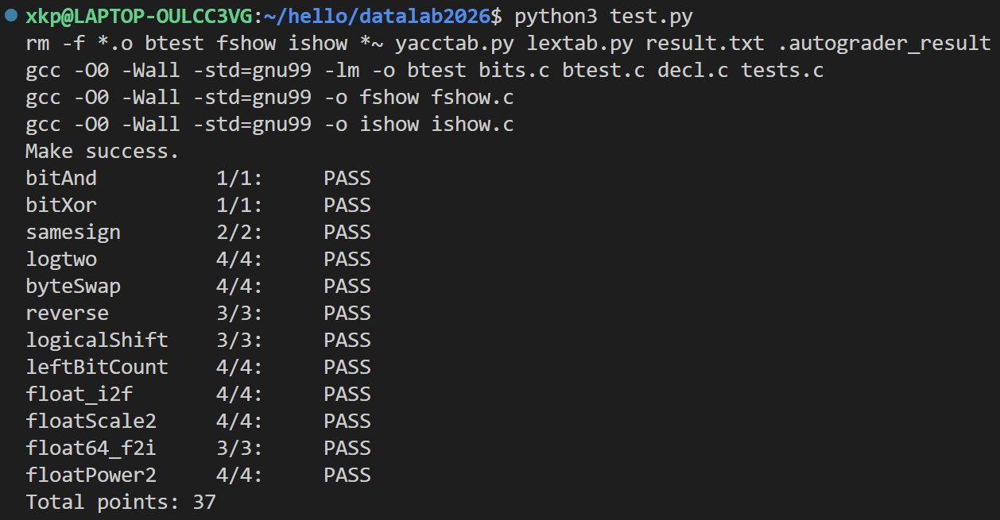

# datalab 报告

姓名：许康鹏

学号：2025201746

| bitAnd | bitXor | samesign | logtwo | byteSwap | reverse |
|:---:|:---:|:---:|:---:|:---:|:---:|
| 1/1 | 1/1 | 2/2 | 4/4 | 4/4 | 3/3 |

| logicalShift | leftBitCount | float_i2f | floatScale2 | float64_f2i | floatPower2 |
|:---:|:---:|:---:|:---:|:---:|:---:|
| 3/3 | 4/4 | 4/4 | 4/4 | 3/3 | 4/4 |

**总分：37/37**

test 截图：

## 解题报告

### 亮点

1. float_i2f
2. float64_f2i
3. reverse

### float_i2f

**思路：**

1. **处理特殊情况**：`x = 0` 和 `INT_MIN` 单独处理。
2. **规格化**：不断左移整数，使最高位 1 移到最高位，同时调整指数。
3. **提取尾数**：取规格化后的 23 位尾数，并记录被截断的部分。
4. **舍入**：按照 IEEE 754 的规则进行舍入，处理尾数进位。
5. **组合结果**：将符号位、指数和尾数组合成最终的浮点数表示。

核心的舍入部分为：

```c
if (rest > 0x80)
    frac = frac + 1;
else if (rest == 0x80 && (frac & 1))
    frac = frac + 1;
```

这里采用了“就近舍入，遇到中间值向偶数舍入”的方法。

### float64_f2i

**思路：**

1. **提取字段**：从 64 位浮点数中获取符号位和指数。
2. **判断范围**：处理 NaN、无穷大、小于 1 以及超出整数范围的情况。
3. **恢复有效数字**：补回隐藏的最高位 `1`。
4. **根据指数移位**：根据实际指数 `E`，通过右移或左移恢复整数部分。
5. **处理符号**：如果符号位为 1，则将结果取负。

恢复有效数字的关键代码：

```c
sig_hi = frac_hi | 0x100000;
```

根据指数恢复整数部分：

```text
如果 E < 21：
    有效数字右移 (20 - E) 位
否则：
    有效数字左移 (E - 20) 位
    再结合低 32 位尾数
```

这种方法通过位操作完成整个转换。

### reverse

`reverse` 使用分治思想，将 32 位数据依次按照 16、8、4、2、1 位进行交换：

```c
v = (v >> 16) | (v << 16);
v = ((v & 0xFF00FF00) >> 8) | ((v & 0x00FF00FF) << 8);
v = ((v & 0xF0F0F0F0) >> 4) | ((v & 0x0F0F0F0F) << 4);
```

后面继续进行 2 位和 1 位的交换即可完成整个二进制位反转。通过掩码和移位，可以避免逐位处理。

## 反馈/收获/感悟/总结

本次实验让我更加熟悉了移位、掩码和补码等位级操作，也加深了对 IEEE 754 浮点数表示的理解。实现浮点数相关函数时，边界情况和舍入规则比较容易出错，通过测试和调试进一步提高了我分析和解决问题的能力。

## 参考的重要资料

1. obe课程资料
2. 《Computer Systems: A Programmer's Perspective》（CS:APP）